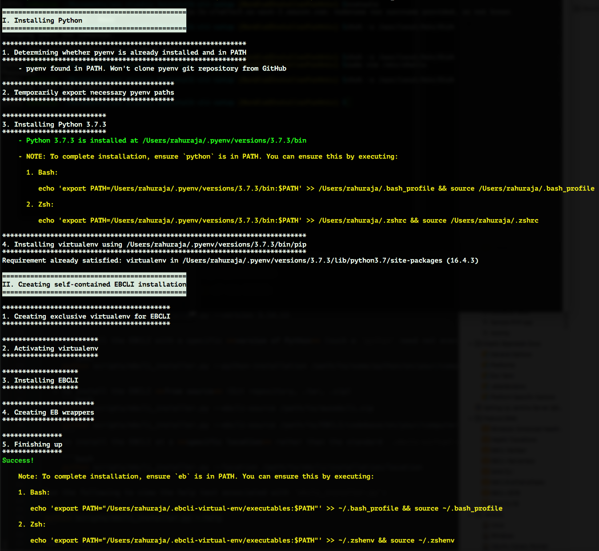

## EB CLI Installer

------

### 1. Overview

------

This repository hosts scripts to generate self-contained installations of the [EB CLI](https://docs.aws.amazon.com/elasticbeanstalk/latest/dg/eb-cli3.html).

------


### 1.1. Prerequisites

If you don't have Git, install it from [Git Downloads](https://git-scm.com/downloads).

Python, which the EBCLI Installer depends on, requires the following prerequisites for each operating system.

- **Linux**
    - **Ubuntu and Debian**

        ```shell
        build-essential zlib1g-dev libssl-dev libncurses-dev libffi-dev libsqlite3-dev libreadline-dev libbz2-dev
        ```

    - **Amazon Linux and Fedora**

       ```shell
       "Development Tools" zlib-devel openssl-devel ncurses-devel libffi-devel sqlite-devel.x86_64 readline-devel.x86_64 bzip2-devel.x86_64
       ```

- **macOS**

     ```shell
     Xcode openssl zlib readline
     ```

------

### 2. Use

------

#### 2.1. Clone this repository

Use the following:

```shell
git clone https://github.com/aws/aws-elastic-beanstalk-cli-setup.git
```

#### 2.2. Install/Upgrade the EB CLI

On **Bash** and **Zsh** on macOS and Linux:

```shell
./aws-elastic-beanstalk-cli-setup/scripts/bundled_installer
```

In **PowerShell** or in a **Command Prompt** window:

```ps1
.\aws-elastic-beanstalk-cli-setup\scripts\bundled_installer
```

#### 2.3. Troubleshooting

- **Linux**

    Most installation problems have been due to missing libraries such as `OpenSSL`.

  - On **Ubuntu and Debian**, run the following command to install dependencies.

    ```shell
    apt-get install \
        build-essential zlib1g-dev libssl-dev libncurses-dev \
        libffi-dev libsqlite3-dev libreadline-dev libbz2-dev
    ```

  - On **Amazon Linux and Fedora**, run the following command to install dependencies.

    ```shell
    yum group install "Development Tools"
    yum install \
        zlib-devel openssl-devel ncurses-devel libffi-devel \
        sqlite-devel.x86_64 readline-devel.x86_64 bzip2-devel.x86_64
    ```

- **macOS**

  Most installation problems on macOS are related to loading and linking OpenSSL and zlib. The following command installs the necessary packages and tells the Python installer where to find them:

    ```
    brew install zlib openssl readline
    CFLAGS="-I$(brew --prefix openssl)/include -I$(brew --prefix readline)/include -I$(xcrun --show-sdk-path)/usr/include" LDFLAGS="-L$(brew --prefix openssl)/lib -L$(brew --prefix readline)/lib -L$(brew --prefix zlib)/lib"
    ```
    Run `brew info` to get the latest environment variable export suggestions, such as `brew info zlib`

- **Windows**

    - In PowerShell, if you encounter an error with the message "execution of scripts is disabled on this system", set the [execution policy](https://docs.microsoft.com/en-us/powershell/module/microsoft.powershell.security/set-executionpolicy?view=powershell-6) to `"RemoteSigned"` and then rerun `bundled_installer`.

      ```ps1
      Set-ExecutionPolicy RemoteSigned
      ```
    - If you encounter an error with the message "No module named 'virtualenv'", use the following commands to install `virtualenv` and the EB CLI:
      ```ps1
      pip uninstall -y virtualenv
      pip install virtualenv
      python .\aws-elastic-beanstalk-cli-setup\scripts\ebcli_installer.py
      ```

#### 2.4. After installation

On Linux and macOS, the output contains instructions to add the EB CLI (and Python) executable file to the shell's `$PATH` variable, if it isn't already in it.

#### 2.5. Demo execution of `bundled_installer`



### 3. Advanced use

To install the EB CLI, `bundled_installer` runs `ebcli_installer.py`. `ebcli_installer.py` has the following capabilities:

  - To install a **specific version** of the EB CLI:

    ```shell
    python scripts/ebcli_installer.py --version 3.14.13
    ```

  - To install the EB CLI with a specific **version of Python** (the Python version doesn't need to be in `$PATH`):

    ```shell
    python scripts/ebcli_installer.py --python-installation /path/to/some/python/on/your/computer
    ```

  - To install the EB CLI **from source** (Git repository, .tar file, .zip file):
    ```shell
    python scripts/ebcli_installer.py --ebcli-source /path/to/awsebcli.zip

    python scripts/ebcli_installer.py --ebcli-source /path/to/EBCLI/codebase/on/your/computer
    ```
  - To install the EB CLI at a **specific location**, instead of in the standard `.ebcli-virtual-env` directory in the user's home directory:

    ```shell
    python scripts/ebcli_installer.py --location /path/to/ebcli/installation/location
    ```

Run the following command to view the help text for `ebcli_installer.py`:

```shell
python scripts/ebcli_installer.py --help
```

### 4. Frequently asked questions

------

#### 4.1. Can I skip the Python installation?

**Yes.** If you already have Python installed on your system, after step `2.1.`, run the following.

On **Bash** and **Zsh**:

```shell
python aws-elastic-beanstalk-cli-setup/scripts/ebcli_installer.py
```

In **PowerShell** and from the **Command Prompt** window:

```shell
python .\aws-elastic-beanstalk-cli-setup\scripts\ebcli_installer.py
```

#### 4.2. For the **experienced Python developer**, what's the advantage of this mode of installation instead of regular `pip` inside a `virtualenv`?

Even within a `virtualenv`, a developer might need to install multiple packages whose dependencies are in conflict. For example, at times the AWS CLI and the EB
CLI have used conflicting versions of `botocore`. [One such instance](https://github.com/aws/aws-cli/issues/3550) was particularly egregious. When there are
conflicts, users have to manage separate `virtualenvs` for each of the conflicting packages, or find a combination of the packages without conflicts.
Both these workarounds become unmanageable over time, and as the number of packages that are in conflict increases.

#### 4.3. On macOS (or Linux systems with `brew`), is this better than `brew install awsebcli`?

**Yes**, for these reasons:

  - The AWS Elastic Beanstalk team has no control over how `brew` operates.
  - The `brew install ...` mechanism doesn't solve the problem of dependency conflicts, which is a primary goal of this project.

#### 4.3. For developers who are **new to Python**, does this mode of installation pose challenges?

The opinion of the AWS Elastic Beanstalk team is "**No**".

Aside from the problem described in `4.2.`, developers new to Python are often confused by the presence of multiple versions of Python and `pip` executable files on
their system. A common problem that such developers encounter is that when they install `eb` with one `pip` executable file (presumably using the `sudo`
prefix),
no `eb`-related commands work because the correct set of directories isn't referenced correctly.

Typically, for such developers, use of `virtualenv` is the correct path forward. However, this becomes yet another hurdle before using `eb`.

Another common problem is where users install Python and `pip` in ways that Elastic Beanstalk Documentation doesn't recommend, such as using arbitrary Personal Package Archives
(PPAs) on Ubuntu, or similar unmaintained sources that lack scrutiny.

#### 4.4. Can I execute the Bash scripts in a Cygwin, git-bash, or other Bash-like shell on Windows?

**No**. At this time, we don't directly support execution on Bash-like environments on Windows. Use PowerShell or the Command Prompt window to install. You can
add the location of the `eb` and `Python` executable files to `$PATH` .

#### 4.5. Can I execute the Bash scripts in a `fish` shell?
**Yes**, but only if you have Bash on your computer. At this time we don't provide specific guidance on how to set `$PATH` in Fish, however, Fish has [detailed documentation](https://fishshell.com/docs/current/tutorial.html#tut_path) for this purpose.

#### 4.6. I already have Python installed. Can I still execute `bundled_installer`?

**Yes**. It's safe to execute `bundled_installer` even if you already have Python installed. The installer will skip reinstallation.

#### 4.7. I already have the EB CLI installed. Can I still execute `ebcli_installer.py`?

**Yes**.

Consider the following two cases:

- `ebcli_installer.py` was previously run, creating `.ebcli-virtual-env` in the user's home directory (or the user's choice of a directory indicated through the
`--location` argument). In this case, the EB CLI will overwrite `.ebcli-virtual-env` and attempt to install the latest version of the EB CLI in the `virtualenv` within it.

- `eb` is in `$PATH`, however, it wasn't installed by `ebcli_installer.py`. In this case, the installer will install `eb` within `.ebcli-virtual-env` in the
user's home directory (or the user's choice of a directory indicated through the `--location` argument), and prompt the user to prefix
`/path-to/.ebcli-virtual-env/executables` to `$PATH`. Until you perform this action, the older `eb` executable file will continue to be referenced when you type `eb`.

#### 4.8. How does `ebcli_installer.py` work?

When executing the Python script, `ebcli_installer.py` does the following:

- Creates a `virtualenv` exclusive to the `eb` installation.
- Installs `eb` inside that `virtualenv`.
- In the `<installation-location>/executables` directory, it generates:
  - A `.py` wrapper for `eb` on Linux or macOS.
  - `.bat` and `.ps1` wrappers for `eb` on Windows.
- When complete, you will be prompted to add `<installation-location>/executables` to `$PATH`, only if the directory is not already in it.

#### 4.8. How does `bundled_installer` work?

- On macOS or Linux, `bundled_installer` uses the extremely popular [`pyenv` project](https://github.com/pyenv/pyenv) to install the latest version of Python 3.7.
- On Windows, it downloads the MSI installer of the latest Python version from Python's website and silently installs it.

#### 4.9. Are there dependency problems that this mode of installation doesn't solve?

Unfortunately, **yes**.

Suppose the dependencies of `eb`, say `Dep A` and `Dep B`, are in conflict. Because `pip` lacks dependency management capabilities, the resulting `eb` installation might not work.

#### 4.10. Is it okay to use Python 2.7 to install the EB CLI?

**Yes**, however, be aware that Python 2.7 will be deprecated on January 1, 2020. There won't be security updates after that date.

Also, the latest minor version series, Python 3.7, offers significant improvements over the Python 2.7 series. We highly recommend that you use Python 3.7
for testing purposes, even though the Elastic Beanstalk team tests the EB CLI against Python 2.7.

### 5. License

This library is licensed under the Mozilla Public License Version 2.0.
